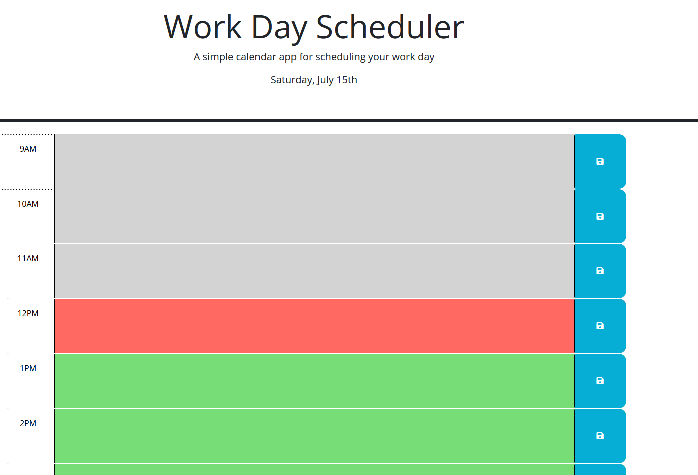
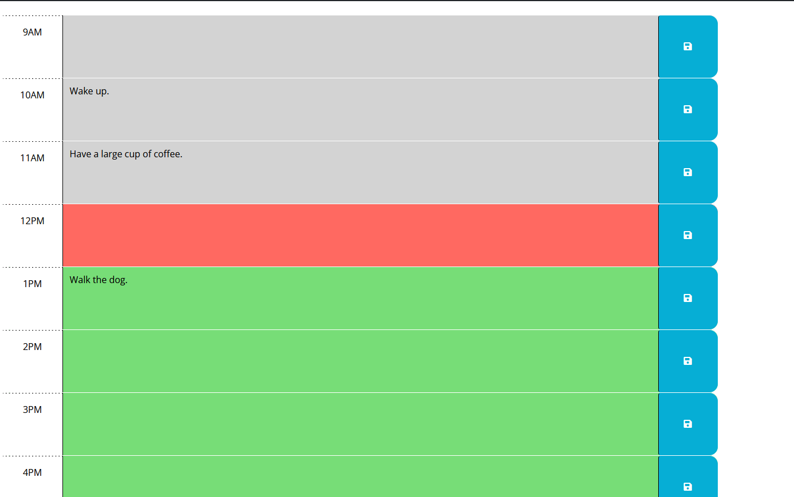

# <week-5-challenge>

## Description

This is a webpage that displays a schedule with the regular working hours of 9-5, you are able to click on each section to add something to the schedule, and click the save button to save it into local storage.

## Table of Contents (Optional)

- [Installation](#installation)
- [Usage](#usage)
- [Credits](#credits)
- [License](#license)

## Installation

run the site either on you own hosting or on the link here:
    https://ghostdads.github.io/Week-5-challenge

## Usage

Upon loading the page, each hour section will be colour coded to display the current hour (red), the hours past(grey), or the hours in the future(green).

you are able to click on the coloured section for each hour and type in an event.
if you click the blue save button, the event will be save into local storage, and on page refresh or load, that event will be displayed in the corresponding hour block.

## Credits

base HTML+CSS done by bootcamp.
JS done by me (Alexander Babic)

## License

MIT lisence

---